# Component Hierarchy & Architecture Diagrams

This document provides visual representations of the application's component structure, data flow, and architectural patterns.

---

## Table of Contents

1. [Application Component Tree](#application-component-tree)
2. [Page Component Breakdown](#page-component-breakdown)
3. [Data Flow Diagram](#data-flow-diagram)
4. [State Management Flow](#state-management-flow)
5. [API Integration Flow](#api-integration-flow)
6. [Authentication Flow](#authentication-flow)
7. [Transaction Flow](#transaction-flow)

---

## Application Component Tree

This diagram shows the complete component hierarchy from App root to leaf components.

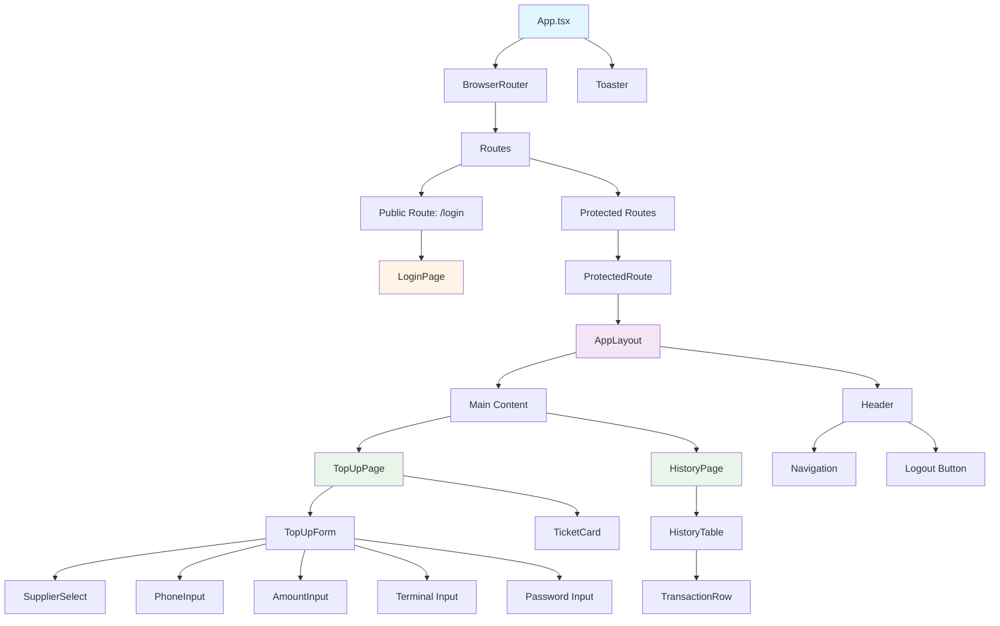

---

## Page Component Breakdown

### LoginPage Components

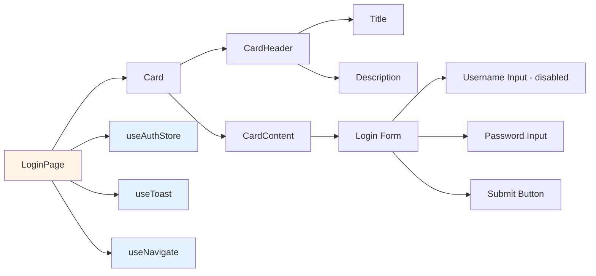

### TopUpPage Components

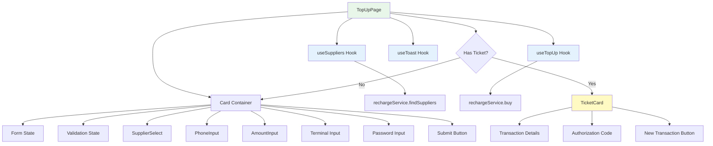

### HistoryPage Components

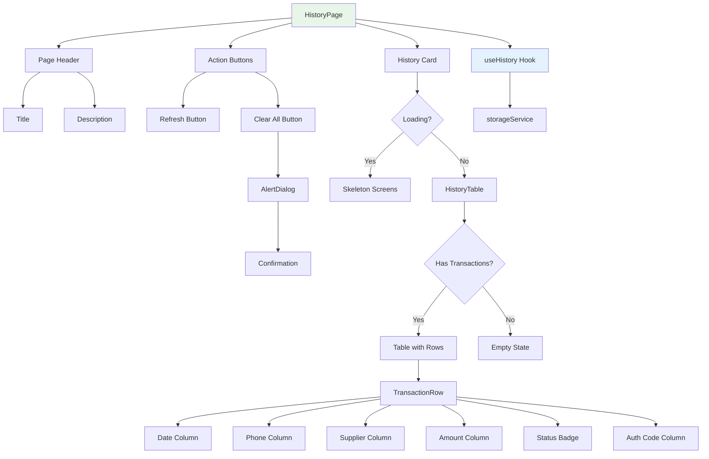

---

## Data Flow Diagram

This diagram illustrates how data flows through the application.

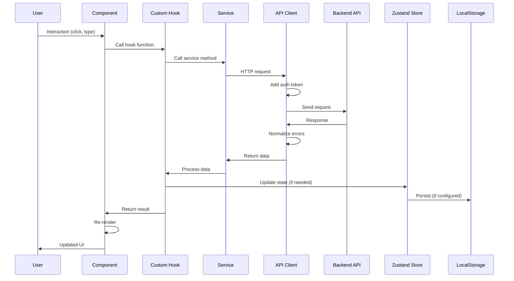

---

## State Management Flow

### Zustand Auth Store Pattern

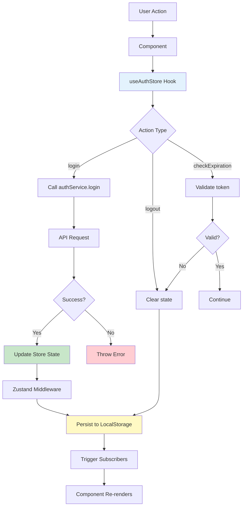

### Component State Pattern

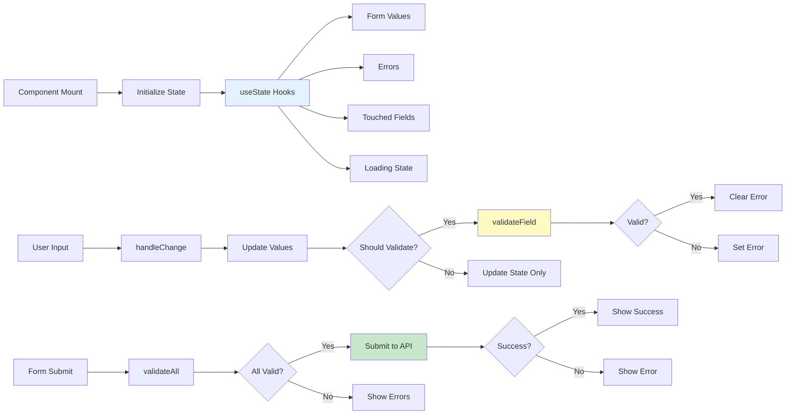

---

## API Integration Flow

### Request Lifecycle

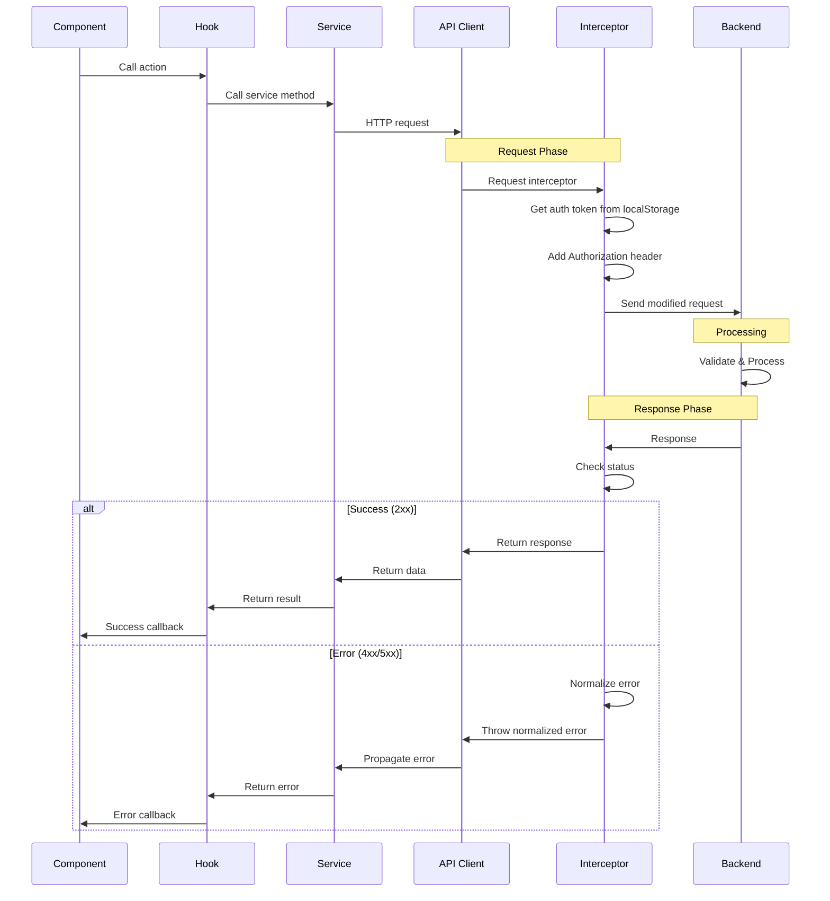

### Error Handling Flow

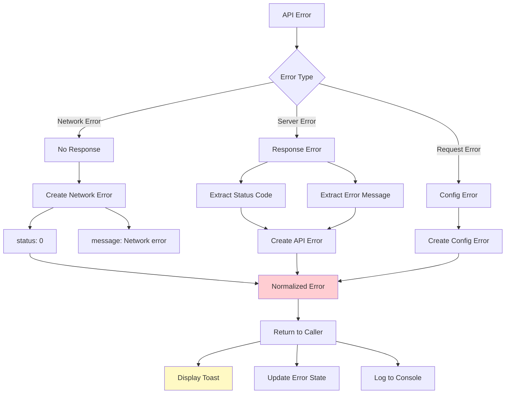

---

## Authentication Flow

### Login Process

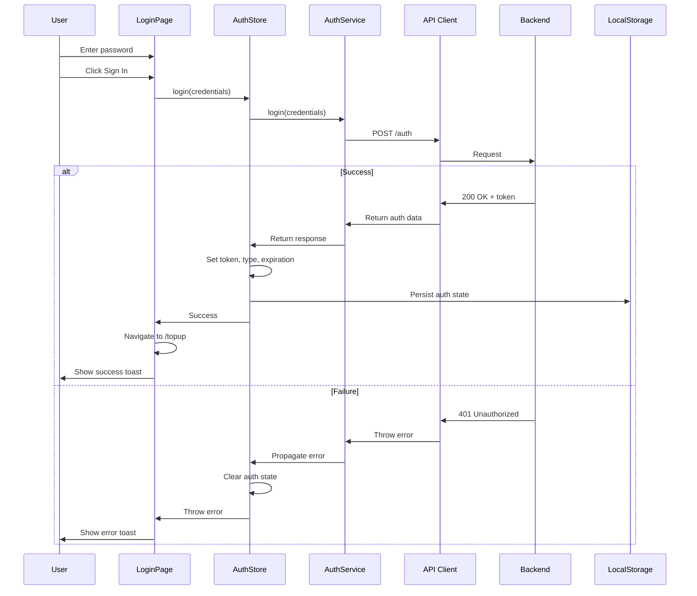

### Protected Route Check

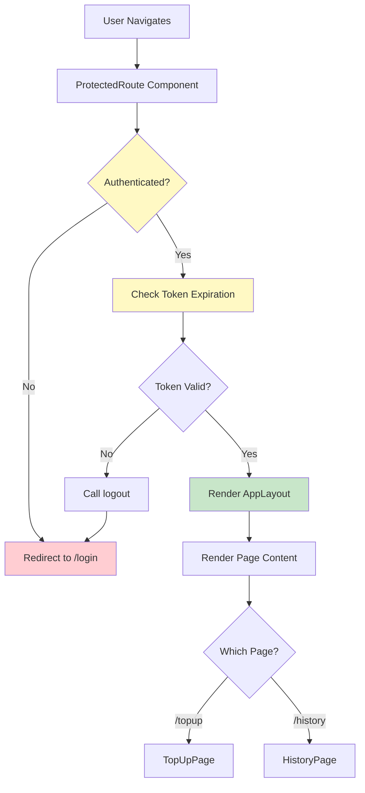

---

## Transaction Flow

### Complete Top-Up Process

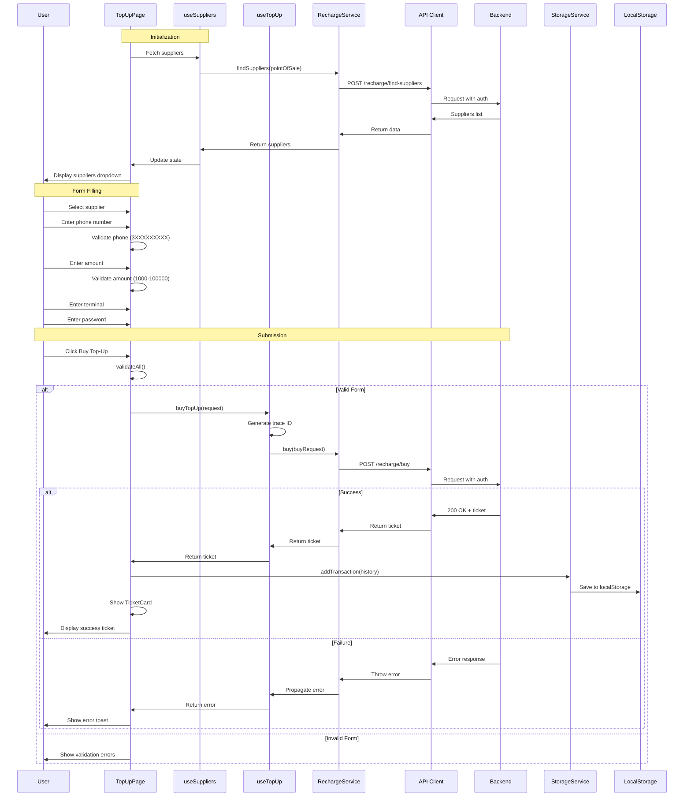

### History Retrieval Flow

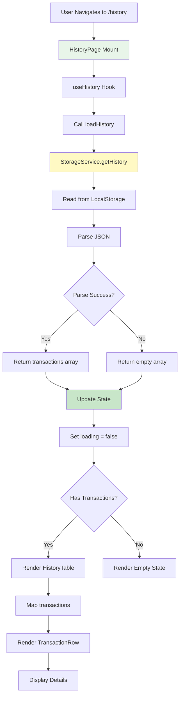

---

## Component Interaction Matrix

This matrix shows which components interact with which services, stores, and hooks.

| Component          | Auth Store | Storage Service | API Hooks                 | Router      |
| ------------------ | ---------- | --------------- | ------------------------- | ----------- |
| **LoginPage**      | ✅ Write   | ❌              | ❌                        | ✅ Navigate |
| **ProtectedRoute** | ✅ Read    | ❌              | ❌                        | ✅ Redirect |
| **AppLayout**      | ✅ Read    | ❌              | ❌                        | ✅ Navigate |
| **TopUpPage**      | ❌         | ✅ Write        | ✅ useSuppliers, useTopUp | ❌          |
| **HistoryPage**    | ❌         | ✅ Read/Write   | ✅ useHistory             | ❌          |
| **TicketCard**     | ❌         | ❌              | ❌                        | ❌          |

---

## Dependency Graph

### Service Dependencies

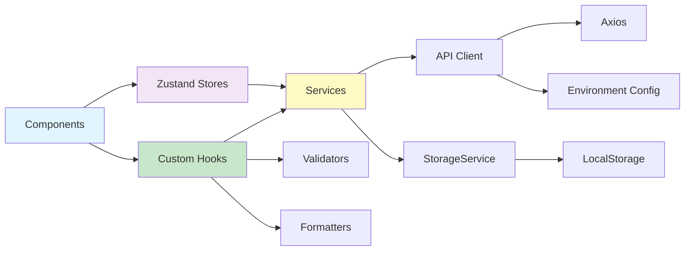

### Type Dependencies

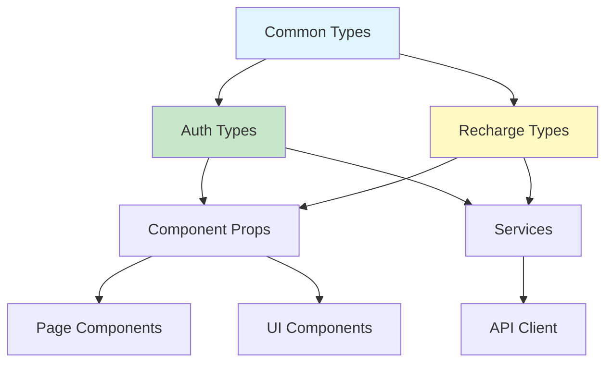

---

## Lifecycle Diagrams

### Component Lifecycle with Data Fetching

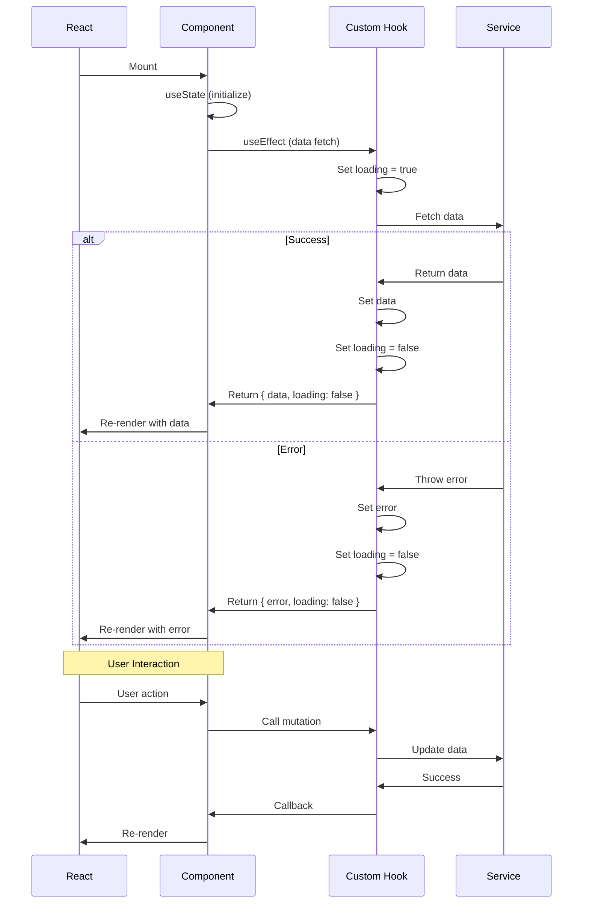

---

## Architecture Patterns

### Custom Hook Pattern

```typescript
// Pattern: Encapsulate API logic in custom hooks
export const useSuppliers = () => {
  const [suppliers, setSuppliers] = useState<Supplier[]>([]);
  const [loading, setLoading] = useState(true);
  const [error, setError] = useState<string | null>(null);

  const fetchSuppliers = async () => {
    try {
      setLoading(true);
      const response = await rechargeService.findSuppliers(pointOfSale);
      setSuppliers(response.data);
    } catch (err) {
      setError(err.message);
    } finally {
      setLoading(false);
    }
  };

  useEffect(() => {
    fetchSuppliers();
  }, []);

  return { suppliers, loading, error, refetch: fetchSuppliers };
};
```

### Service Layer Pattern

```typescript
// Pattern: Separate business logic from UI
class RechargeService {
  async buy(request: BuyRechargeRequest): Promise<BuyRechargeResponse> {
    // Validation, transformation, API call
    return apiClient.post<BuyRechargeResponse>(API_ENDPOINTS.BUY, request);
  }
}
```

### Validation Pattern

```typescript
// Pattern: Pure functions for validation
export const validatePhone = (phone: string): ValidationResult => {
  if (!phone) return { isValid: false, error: "Required" };
  if (!/^3\d{9}$/.test(phone))
    return { isValid: false, error: "Invalid format" };
  return { isValid: true };
};
```

---

## Summary

This component hierarchy demonstrates:

1. **Clear Separation of Concerns** - UI, business logic, and data access are separated
2. **Unidirectional Data Flow** - Data flows from stores → hooks → components
3. **Encapsulation** - Complex logic is hidden in hooks and services
4. **Reusability** - Components and hooks can be reused across pages
5. **Testability** - Each layer can be tested independently
6. **Maintainability** - Changes are localized to specific layers

The architecture follows React best practices and modern patterns for building scalable applications.
